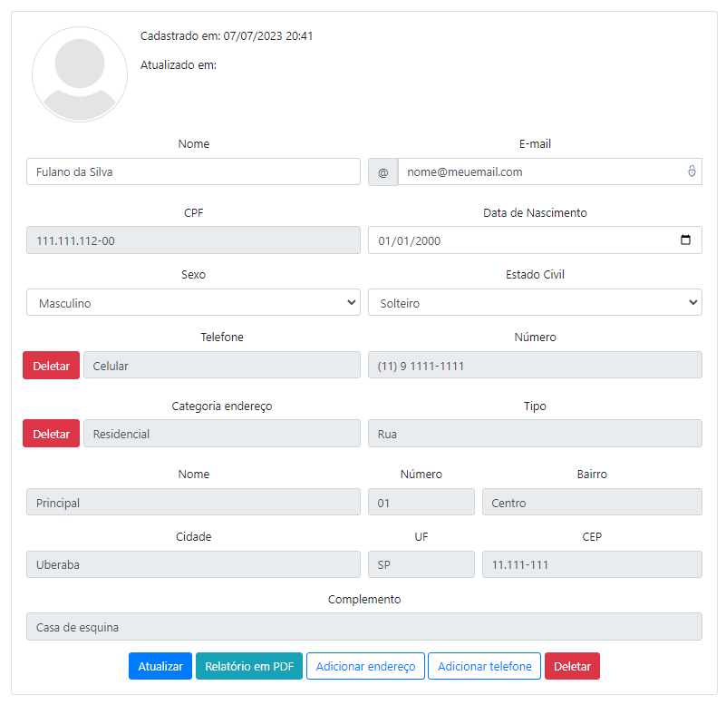

# Clientes Gestor

### Esse projeto faz parte dos meus estudos sobre programação e teste de software.

Software Web para cadastro de clientes com URL amigavel usando PHP Orientado a Objetos com banco de dados Postgresql com PDO.



## Recursos usados no desenvolvimento:

- PHP 7;
- PostgreSQL 12;
- pgModeler 0.9.3;
- HTML;
- Bootstrap v4.5.3;
- Apache HTTP Server;
- DBeaver Community Edition;
- Git;
- Visual Studio Code;

## Instalação:

Para começar, você deve simplesmente clonar o repositório do projeto na sua máquina, instalar os pre-requisitos, criar o banco de dados e configurar o arquivo database.php.

## Pre-requisitos:

Antes de instalar o projeto, você precisa já ter instalado na sua máquina:

- Apache;
- Ativar o módulo mod_rewrite do Apache;
- PHP;
- Ativar o módulo pgsql do PHP;
- PostgreSQL;

## Obtendo uma cópia:

```shell
# Antes de tudo, clone o projeto
$ git clone https://github.com/douglascarlos-dev/Clientes-Getor
```

## Configuração:

```php
# Entre na pasta 'model' do projeto e crie um arquivo database.php
# com os dados de conexão do banco de dados PostgreSQL.
<?php
return [
    "host" => "localhost",
    "port" => "5432",
    "dbname" => "",
    "user" => "",
    "password" => ""
];
?>

# Usuário e senha padrão do software: admin
```

## Modelagem do banco

A pasta pgmodeler contem a modelagem do banco usando o programa pgModeler 0.9.3, bem como uma imagem da modelagem e o arquivo sql de criação do banco.
É necessario estar instalado o módulo pgsql para php para uma correta comunicação.

