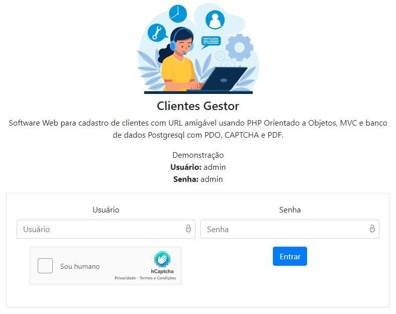
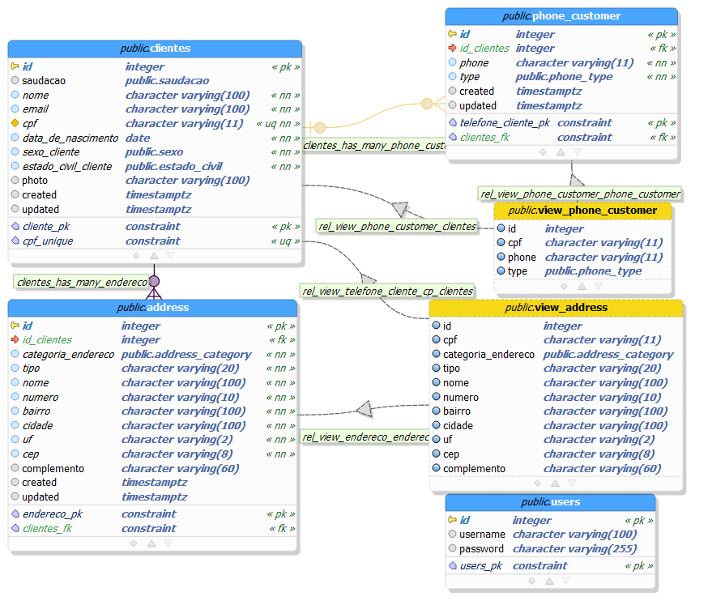

# Clientes Gestor

### Esse projeto faz parte dos meus estudos sobre programação e teste de software.

Software Web para cadastro de clientes. No seu desenvolvimento foi utlizado URL amigável usando PHP Orientado a Objetos, MVC, banco de dados Postgresql com PDO, CAPTCHA, PDF e upload de imagem.




## Recursos usados no desenvolvimento:

- [PHP](https://www.php.net/) 8.1.2;
- [PostgreSQL](https://www.postgresql.org/) 14.5;
- [pgModeler](https://github.com/pgmodeler/pgmodeler) 0.9.4;
- HTML;
- [Bootstrap](https://github.com/twbs/bootstrap) v4.6.0;
- [jQuery](https://github.com/jquery/jquery) v.3.5.1;
- [Apache HTTP Server](https://github.com/apache/httpd);
- [DBeaver Community Edition](https://github.com/dbeaver/dbeaver);
- [Git](https://git-scm.com);
- [Visual Studio Code](https://github.com/Microsoft/vscode/);
- MVC;
- [PlantUML](https://github.com/plantuml/plantuml);
- [hCaptcha](https://www.hcaptcha.com/);
- [Dompdf](https://github.com/dompdf/dompdf) 2.0.0;
- [GD](https://www.php.net/manual/pt_BR/book.image.php);

## Instalação:

Para começar, você deve simplesmente clonar o repositório do projeto na sua máquina, instalar os pre-requisitos, criar o banco de dados e configurar o arquivo database.php.

## Pre-requisitos:

Antes de instalar o projeto, você precisa já ter instalado na sua máquina:

- Apache;
- Ativar o módulo mod_rewrite do Apache;
- PHP;
- Ativar o módulo pgsql do PHP;
- Ativar a extensão GD do PHP;
- Ativar a extensão cURL do PHP;
- Ativar a extensão mbstring do PHP;
- Ativar a extensão SimpleXML do PHP;
- PostgreSQL;

## Obtendo uma cópia:

```shell
# Antes de tudo, clone o projeto
$ git clone https://github.com/douglascarlos-dev/Clientes-Gestor
```

## Configuração:

```php
# Entre na pasta 'model' do projeto e crie um arquivo database.php
# com os dados de conexão do banco de dados PostgreSQL.
<?php
return [
    "host" => "localhost",
    "port" => "5432",
    "dbname" => "",
    "user" => "",
    "password" => "",
    "captcha_secret" => "0x0",
    "captcha_data-sitekey" => ""
];
?>

# Informe o nome da pasta em que o projeto está executando no arquivo index.php
# Exemplo:
define('ENDERECO', '/php-pdo-oop-clean-urls-postgresql'); // ou
define('ENDERECO', '/' . basename(__DIR__)); // ou
define('ENDERECO', '/douglas/' . basename(__DIR__)); // ou
define('ENDERECO', ''); //se executar no dirtorio root.

# Usuário e senha padrão do software: admin
```

## Modelagem do banco

A pasta pgmodeler contem a modelagem do banco usando o programa pgModeler 0.9.4, bem como uma imagem da modelagem e o arquivo sql de criação do banco.
É necessario estar instalado o módulo pgsql para php para uma correta comunicação.



## Diagrama de classes

A [pasta modelagem](https://github.com/douglascarlos-dev/Clientes-Gestor/tree/main/modelagem) contem os diagramas de UML criados usando o programa PlantUML, permitindo identificar as classes, métodos, atores e interações utilizadas na execução do software.

