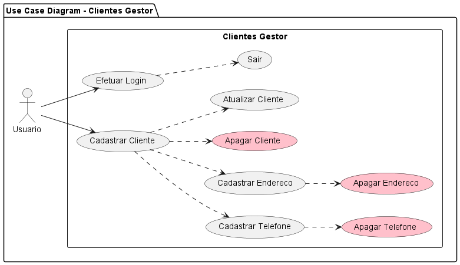

# Clientes Gestor

## Diagramas

A pasta modelagem contem os diagramas de UML criados usando o programa PlantUML, permitindo identificar as classes, métodos, atores e interações utilizadas na execução do software.

